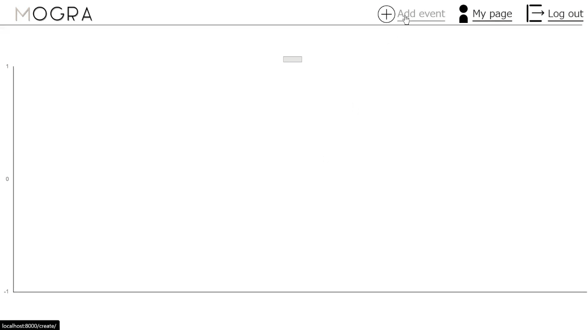

# *ポートフォリオ用　自己分析支援ツール"MOGRA"* 

## 概要
> 就活に悩む大学生をターゲットとして、モチベーショングラフの作成支援によって
> 自己分析を円滑を進めることを目的に開発を行った。

## サイトURL <!-- URLは用意してください -->

<a href="https://mogra.ngrok.app/" target="_blank" rel="noopener noreferrer">MOGRA</a>

## テスト用アカウント <!--用意するのであれば作っておいてください -->

> - ユーザー名
>     - sample
> - password
>     - efULx/vMyEWU4

## 主な使用技術 <!--　必要であればver等追記してください --> 
> ## フロントエンド　　Chart.js
> ## バックエンド　
> ## データベース　
> ## その他　

## 開発ツール
> ## 
> ## 　Miro

## 機能一覧

> - ログイン機能
>     - アカウント作成・修正 
>     - パスワードリセット
>
> - モチベーショングラフ作成機能
>     - イベント作成・削除・編集
>     - グラフ描画

> - その他
>     - ランディングページ

## 開発期間

> 約2週間 
> 毎日コアタイムを設定し開発に取り組んだ

## 動作方法
- アカウント作成(テスト用アカウント使用の場合は省略)
> - ランディングページ右上の"Sigh up"をクリック
> - 氏名、メールアドレス、パスワードを入力後,画面右下"登録"をクリック
> - ログインページに遷移

- ログイン
> - ランディングページ右上の"Log in"をクリック
> - テスト用アカウントor作製したアカウントを入力

- グラフ作成-イベント追加
> - 画面上部"Add event"をクリック
> - イベント名、詳細、日時を入力。イベント評価度はスライダーにて入力
> 

- グラフ作成-イベント編集・削除
> - 編集するイベントをクリック
> - 編集項目入力後”編集”をクリック。削除の場合は"削除"をクリック
> 

   
- アカウント編集
> - 画面上部"My page"をクリック
> - 修正する情報の"変更"をクリック
> - 修正後画面右下"変更"をクリック

